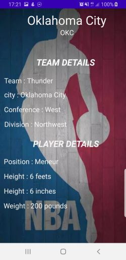
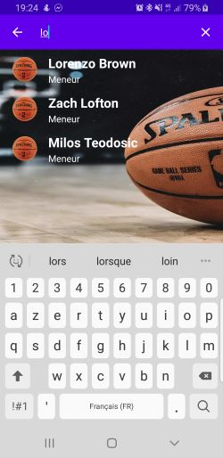

# Projet d'application mobile 3A

## Présentation

Voici mon premier projet d'application mobile via Android Studio codé en Java.
Cette application affiche une liste de joueur de la NBA et propose pour chacun d'eux de d'en savoir plus sur le joueur.
L'application utilise l'Api "balldontlie".


## Prérequis

* Installation d'Android Studio </br>
````
 Chemin vers l'Api : https://www.balldontlie.io/#get-all-teams 
````


## Consignes respectées : 

* Architecture :
	* Design Pattern
	* MVC
	* Principes(SOLID)
* Recupération des données via une ApiREST
* Système de sauvegarde cache
* Appels REST
* Affichage d'une liste dans un RecyclerView
* Affichage du détail d'un item de la liste
* Gitflow
* Fonctions supplémentaires :
	* Barre de recherche
  
  ## Fonctionnalités: 
  
  ### Ecran Home 
  
  - Affiche la liste des joueurs avec une barre de recherche.
  
  
  
  
  
  ### Ecran du détail d'un joueur

- Affiche les différentes informations sur le joueur
 * Détail Joueur
    * Position en match
    * Taille
    * Envergure de la main
    * Poids
  
  * Détail de l'équipe du joueur
    * Nom de l'équipe
    * Ville
    * Conférence
    * Division


 
 
 
 ### Filtres 

Affichage obtenu avec la selection de lettre "lo"




  
